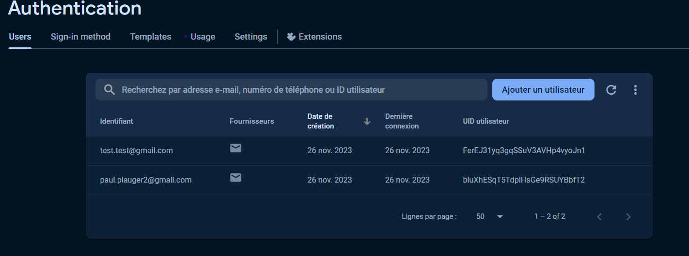
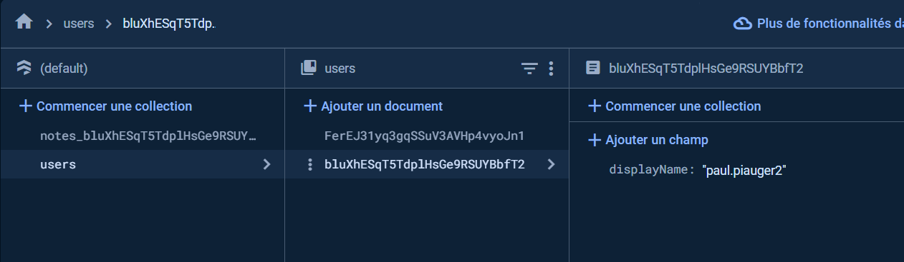

# Note's

Note's est une application de prise de notes qui permet aux utilisateurs de créer, modifier et supprimer leurs notes après s'être connectés. Chaque utilisateur dispose d'une session individuelle pour gérer ses propres notes. L'application intègre un système de login/register et utilise Firebase pour stocker les utilisateurs et leurs notes.

## Fonctionnalités

- Inscription/Connexion :
    Les utilisateurs peuvent créer un compte ou se connecter avec leurs identifiants.
- Gestion des Notes :
    Création de nouvelles notes.
    Modification du contenu des notes existantes.
    Suppression de notes.
- Sessions Utilisateurs :
    Chaque utilisateur a sa propre session pour gérer ses notes.
- gestion des erreurs :
    lors d'une erreur l'utilisateur est rediriger vers une page d'erreur.

## Technologies Utilisées

- Flutter
- Firebase

# Rapport

## Problèmes rencontrés

- Probleme de creation de la database sur Firebase
    Nayant jamais utilisé Firebase avant, j'ai eu du mal à créer la database, je ne trouver pas les bon onglet et il me manquer des case a coché comme le mode test pour pouvoir enregistrer mes utilisateur. J'ai finalement réussi à créer la database et à la lier à mon application en suivant les doc.

- Probleme de popup
    Pour ma premiere popup, celle pour ajouter des notes, j'ai rencontré un probleme qui est que lorsque je cliquer sur le bouton pour ajouter une note, la popup s'ouvrait mais elle ne se fermer pas lorsque je cliquer sur le bouton pour ajouter la note. J'ai finalement réussi à régler le probleme en utilisant un return dialog.

- Probleme d'affichage du nom d'utilisateur
    Pour mes test j'avais besoin de savoir quel utilisateur etais connecté, donc j'ai pris la parti du mail. De plus c'est une fonctionnalité interessant pour l'utilisateur. Mais le probleme rencontré est que le nom d'utilisateur ne s'afficher tout simplement pas. J'essayer de l'afficher via la page qui contient tout les utilisateur sur firebase FirebaseAuth jusqu'a ce que je comprennent qu'il n'y avait tout simplement pas de nom d'utilisateur. J'ai donc créé une nouvelle table qui recupere sur FirebaseFirestore qui recupere l'id est met la premiere partie du mail dans un displayName. Et bizzarement ca marcher mieux :D.

- Probleme de gestion d'erreur
    Je voulais faire un systeme qui redirige l'utilisateur sur une seul page avec un text qui change en fonction de l'erreur mais je ne s'avait pas comment recuperer l'erreur et rediriger. Apres beaucoup de test j'ai trouver que je pouvais avoir les code erreur dans le terminal et donc les utiliser pour rediriger l'utilisateur.

Voila pour les principaux probleme que j'ai rencontré.

## Améliorations possibles

- Ajouter une fonctionnalité de partage de note
- Ajouter une fonctionnalité de modification de mot de passe
- Ajouter une fonctionnalité de modification de nom d'utilisateur
- Ajouter une fonctionnalité de suppression de compte
- Ajouter une fonctionnalité d'ajout d'image dans les notes

## Images 

